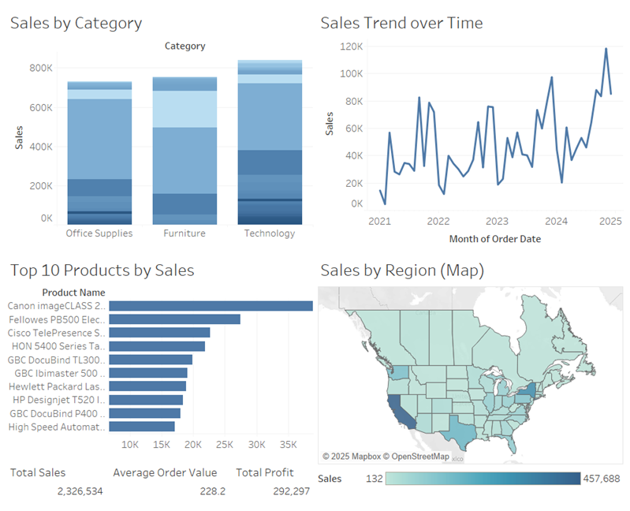

# 📊 Business Dashboard – Sales & Revenue Monitoring

This project visualizes sales and profitability trends for a fictional retail company using the Superstore dataset. It highlights key KPIs and provides interactive filters for region, product category, and time period.

## 🎯 Objective

Provide a dynamic, user-friendly dashboard to:
- Track total sales, profit, and order volume
- Analyze performance by product category and region
- Surface trends over time
- Enable interactive filtering for stakeholder exploration

## 🛠 Tools Used

- Tableau (Public)
- Superstore sample dataset

## 🔍 Dashboard Features

- **KPI Tiles** for Total Sales, Total Profit, Average Order Value
- **Line Chart** for Sales Trend Over Time
- **Bar Chart** for Sales by Category
- **Map** for Sales by State/Region
- **Top Products List** based on Sales
- **Interactive Filters** for Category, Region, and Time
- **Dashboard Actions**: Filter by clicking charts (e.g., region/category)

## 🗂 Files

- `dashboard.twbx` – Tableau workbook file
- `overview.png` – Static image preview of dashboard

## 🔗 Dataset Source

Tableau Sample - Superstore

## 📈 Dashboard Preview

## 📥 View Live

[🔗 View on Tableau Public](#) (https://public.tableau.com/app/profile/ray.zhou/viz/salesandrevenue_17456048121610/SalesandRevenue)
